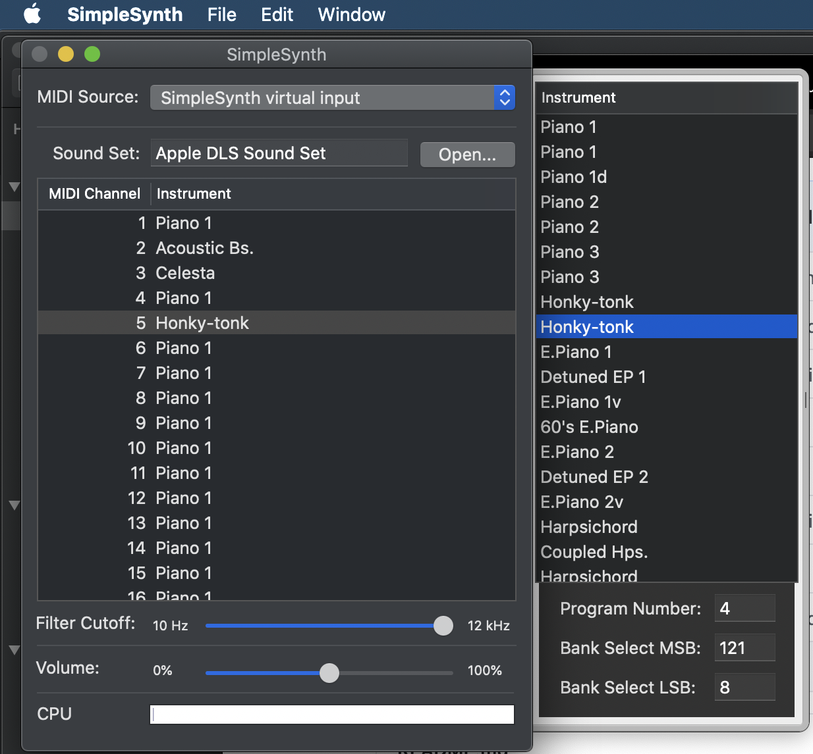

# Haskell Installation


## :a: [`ghcup`](https://www.haskell.org/ghcup/)

## :one: Install Haskell

```
$ curl --proto '=https' --tlsv1.2 -sSf https://get-ghcup.haskell.org | sh
```

### :two: set Env Variable (~/.bashrc or ~/.zshrc)

```
[ -f "${GHCUP_INSTALL_BASE_PREFIX:=$HOME}/.ghcup/env" ] && source "${GHCUP_INSTALL_BASE_PREFIX:=$HOME}/.ghcup/env"
```

## :three: `gcup` usage

* List all installed binaries

```
$ ghcup list
```

* Install a specific version (ghc 8.6.3 is recommanded to use Euterpea )

```
$ ghcup install 8.6.3
```

* Set a specific version

```
$ ghcup set 8.6.3
```

## :b: Euterpea Module Library

* Update `cabal`'s libraries

```
$ cabal update
```

* Install the `Euterpea` module

```
$ cabal install Euterpea
```

* If using `cabal` 3.x version

```
$ cabal v1-install Euterpea
```

## :ab: MIDI Player

 </img>
