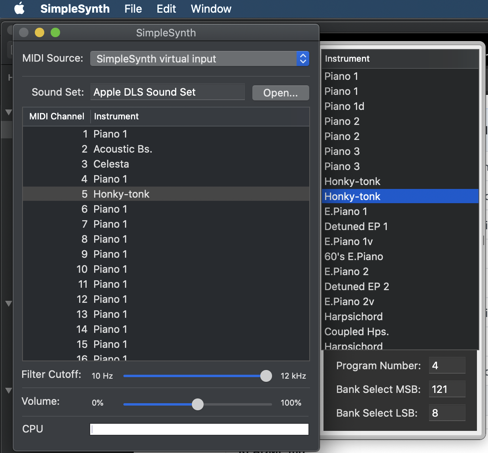

## :o: MIDI Player

As stated by the `Euterpea` website, I can use [`SimpleSynth`](http://notahat.com/simplesynth) on my Mac.

Since I run MacOS Catalina I had to recompile `SimpleSynth` https://github.com/setrar/simplesynth to upgrade the version

 </img>
